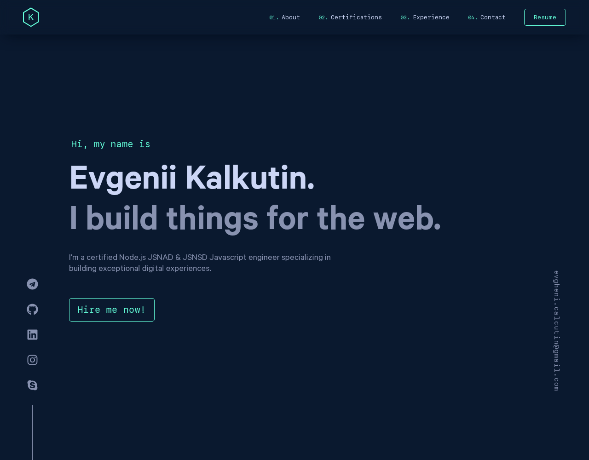

# Resume - High-Performance Portfolio Website


A blazing-fast, 100% PageSpeed optimized portfolio website with server-side rendering. This project showcases modern web development techniques focused on performance and clean architecture.



## 📌 Important Note

**If you use this project as a template or inspiration for your own portfolio, please provide attribution to Evgenii Kalkutin by including a link back to the original repository or website.**

## 🚀 Features

- **100% PageSpeed Score** (Web Vitals) optimized performance
- **Server-Side Rendering** for improved SEO and initial load time
- **Modern React** with TypeScript for type safety
- **CSS Modules** for component-scoped styling
- **Optimized Asset Delivery** (fonts, images)
- **Docker Support** for easy deployment
- **Zero Runtime Dependencies** - minimal and efficient

## 🛠️ Technology Stack

- **Frontend:**

  - React 19
  - TypeScript
  - Modern CSS 3 and modules

- **Backend:**

  - Node.js
  - Express for server-side rendering

- **Build System:**

  - Webpack 5
  - esbuild-loader for fast compilation
  - CSS optimization and minification
  - Asset optimization

- **DevOps:**
  - Docker multi-stage builds
  - Performance-optimized production setup

## 📦 Project Structure

```
├── src/
│   ├── client/           # React client code
│   │   ├── components/   # Reusable UI components
│   │   ├── sections/     # Main page sections
│   │   ├── layouts/      # Page layouts
│   │   ├── styles/       # Global styles
│   │   └── assets/       # Static assets
│   └── server/           # Node.js SSR server
├── webpack.*.ts          # Webpack configurations
├── public/               # Static public files
└── Dockerfile            # Docker configuration
```

## 🚀 Getting Started

### Prerequisites

- Node.js (>=18)

### Installation

```bash
# Clone the repository
git clone https://github.com/ecalcutin/resume.git
cd resume

# Install dependencies
npm install

# Start the development server
npm start
```

### Building for Production

```bash
# Build both client and server
npm run build

# Run the production server
node build/server/server.js
```

### Docker Deployment

```bash
# Build the Docker image
docker build -t resume .

# Run the container
docker run -p 3000:3000 resume
```

## ⚡ Performance Optimizations

This website achieves a perfect 100% score on Google PageSpeed Insights through:

- Server-side rendering with hydration
- CSS optimization and inlining critical CSS
- Modern image formats (WebP)
- Optimized font loading strategy
- Code splitting and tree shaking
- Minimal runtime dependencies
- Efficient asset caching

## 🔄 Contributing

Contributions are welcome! If you'd like to improve this project:

1. Fork the repository
2. Create a feature branch (`git checkout -b feature/amazing-feature`)
3. Commit your changes (`git commit -m 'Add some amazing feature'`)
4. Push to the branch (`git push origin feature/amazing-feature`)
5. Open a Pull Request

---

Built with ❤️ by Evgenii Kalkutin
